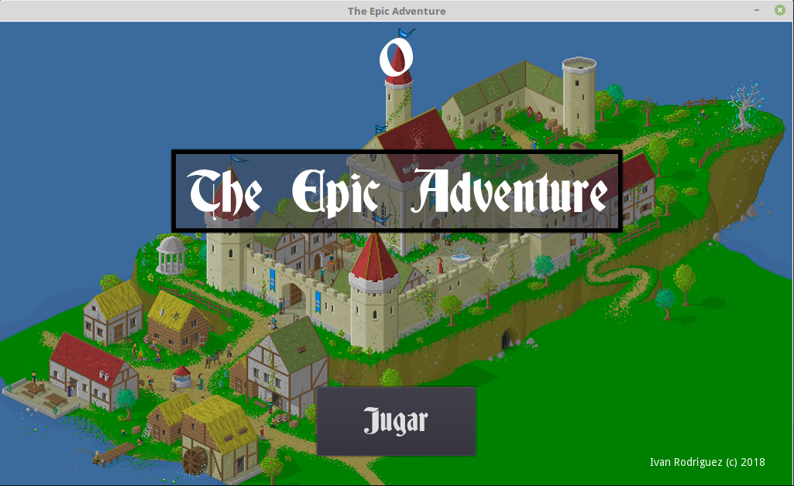
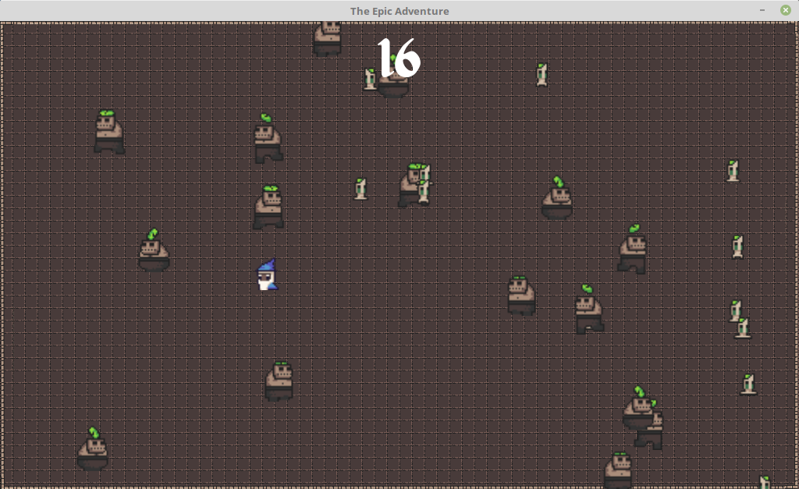

# The Epic Adventure 
> Juego desarrollado utilizando Godot Engine

## :game_die: Introducción

The Epic Adventure es un juego en desarrollo, para el canal de Youtube [Piensa 3D](https://www.youtube.com/channel/UC0-azsu5e8CxZfTl9mmafww?view_as=subscriber). El objetivo del desarrollo de este juego es principalmente el afán de adquirir nuevos conocimientos con respecto a este campo.

### Mecánicas

La idea principal del juego es huir de los zombies durante el mayor tiempo posible. El jugador que más tiempo aguante vivo será el que obtenga una mayor puntuación. Las mecánicas de control son las siguientes:

- **&uarr;**: Mueve el personaje hacia arriba.
- **&darr;**: Mueve el personaje hacia abajo.
- **&larr;**: Mueve el personaje a la izquierda.
- **&rarr;**: Mueve el personaje a la derecha.
- ***Shift* + *Tecla de movimiento***: Hace que el personaje se mueva más rápido.

### :video_game: Capturas del juego

A continuación les muestro algunas capturas realizadas durante la ejecución del juego.

#### Pantalla principal del juego

#### Partida en marcha

## :computer: Software utilizando

Todas las herramientas utilizadas en el desarrollo de este juego pueden encontrarse de forma libre en internet. Las herramientas utilizadas son las siguientes:

- [Godot Engine](https://godotengine.org/)
- [Python 2.7](https://www.python.org/download/releases/2.7/)
- [Gimp](http://www.gimp.org.es/)
- [Audacity](https://www.audacityteam.org/)

## :wrench: Recursos utilizados

La mayor parte de los *tiles sets* utilizados en este juego han sido descargados desde webs especializadas, al igual que el *soundtrack* del juego. Los enlaces de los recursos utilizados son los siguientes:

- [Pack de tiles I](https://0x72.itch.io/16x16-dungeon-tileset)
- [Pack de tiles II](https://0x72.itch.io/dungeontileset-ii)
- [Soundtrack principal](https://arcofdream.itch.io/monolith-ost)

## :mailbox: Contacto

Para más información sobre el juego, su desarrollo o alguna consulta adicional, puedes contactar a través de la siguiente dirección de correo: <piensa3d.dudas@gmail.com>
